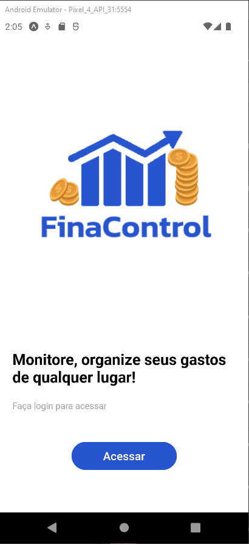
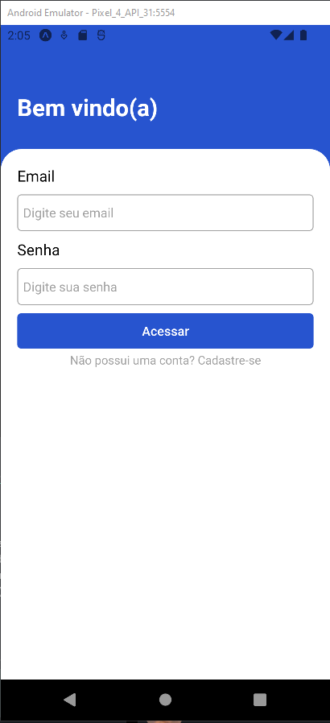
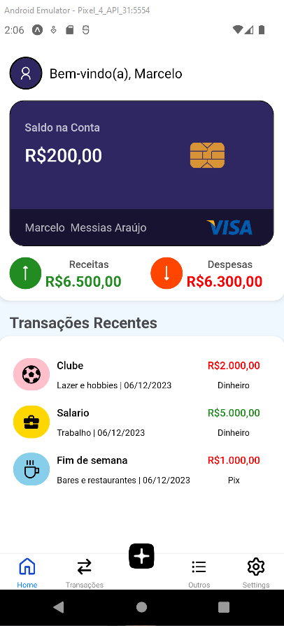
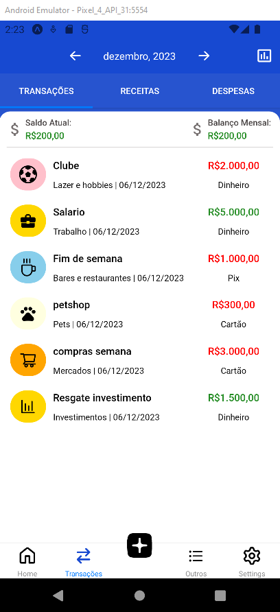
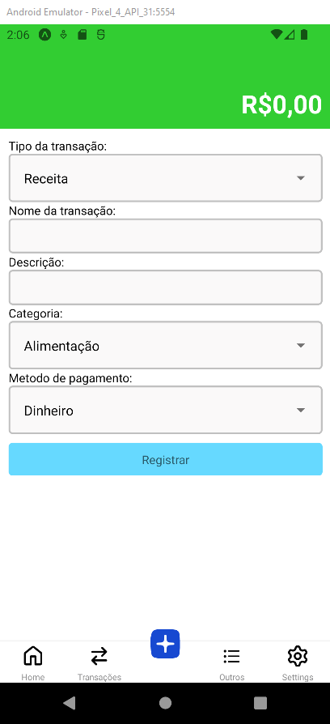
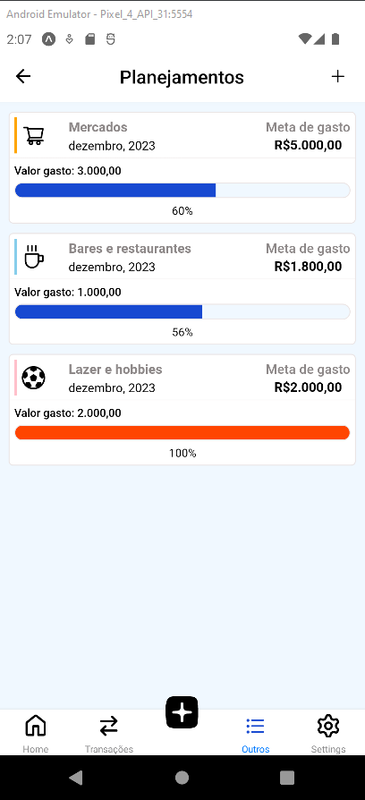

# FinaControl

The FinaControl app is an innovative mobile personal finance application developed using React Native, Typescript and Expo. For data storage and user authentication, I integrated Supabase, a powerful platform that provides a scalable database and secure authentication solutions

## Description

FinaControl is your perfect companion for personal finance management. With this intuitive app, you can effortlessly add and remove expenses, visually analyze your spending through informative graphs, and access a planning section that helps you set monthly goals. Set your monthly budget and watch the planning adjust in real-time. With a sleek and user-friendly design, FinaControl makes financial control a simple and enjoyable experience.

## Requirements

Before running the app, make sure you have the following set up in your development environment:

- Node.js
- NPM (Node Package Manager)
- Expo CLI
- iOS or Android emulator or a physical device with the Expo Go app installed

## Installation

Follow these steps to set up and run the Inspect App:

1. Clone this repository to your local machine:

- git clone https://github.com/marceloaraujo28/finance-app.git

2. Install project dependencies:

- npm install

3. Start the app using Expo:

- expo start

To run the app on an Android emulator or device, you can use the following command:

- expo start --android

To run the app on an iOS simulator or device, you can use the following command:

- expo start --ios
